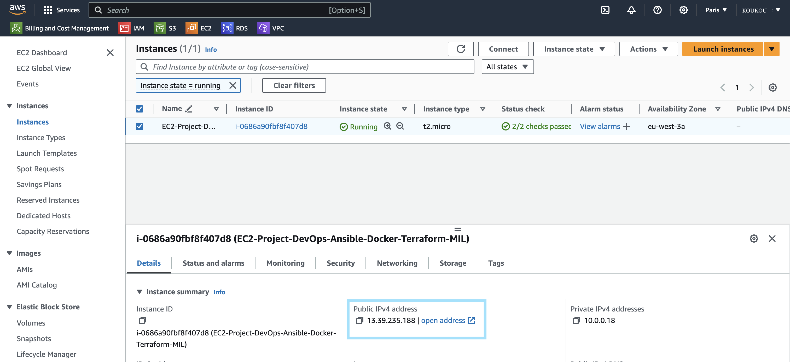

# Projet DevOps - Mise en oeuvre dʼAnsible, Docker & Terraform

|                        |
|------------------------|
| Group IGS IPI Toulouse |
| Master IL 2023/2025    | 
| Devops & Cloud         |
| Priscilla Joly         |

Create and manage an AWS virtual machine using `Ansible` and `Terraform`.

Create a Docker Image containing a `README` and a web-server application.

## Requirements

- Node.js version >= v18.17.0 is required.
- Have an AWS Account
- Docker install on your machine _(local test)_

## 🚀 Launch project

- Init and apply Terraform
- Run Ansible playbook

## NextJS application

### Start application

```bash
cd client
```

**Install packages :**
```bash
npm install
```

**Run app** :
```bash
npm run dev # Or see cleint/REAMDE.md
```

[Localhost](http://localhost:3000)

##  ☁️️AWS

|                      | AWS service name |
|----------------------|------------------|
| Virtual Machine (VM) | EC2              |
| Virtual Machine (VM) | EC2              |

## 🐳 Docker

**File :** `Dockerfile`

- Create a Docker Image of my application

> Check if Docker is running on your computer

```bash
docker build DOCKERFILE_PATH

# docker build DOCKERFILE_PATH -t TAG_NAME
```

**List Docker Images and get Image ID**

```bash
docker images
```

```bash
docker run -p LOCAL_PORT:CONTAINER_PORT IMAGE-ID

# or docker run -p LOCAL_PORT:CONTAINER_PORT TAG_NAME
```

[Localhost](http://localhost:3000)

## 🛠 Terraform

**Folder** : `terraform-aws`

- Create VM on AWS

```bash
cd terraform-aws
```

> 💡Generate a SSH key

> 💡You can add your own variables value in `prod.tfvars` 

```bash
terraform init
```

```bash
terraform plan
```

```bash
terraform apply

# or terraform apply -var-file {FILE NAME VARS}
```

```bash
terraform destroy

# or terraform apply -var-file {FILE NAME VARS}
```

Try to connect to your EC2 instance

## 🧰 Ansible

**Folder** : `ansible`

- Install Docker
- Build and push Docker Image on AWS VM

In `ansible/inventory` add the `ansible_hostname` corresponding to your EC2 Adress IP

**Run playbook**

```bash
ansible-playbook -i inventory.ini playbook.yml
```

Access to your application :
> http://YOUR_ADRESS_IP:3000/

## Others 

### Generate a public key

```bash
ssh-keygen -t rsa -b 2048 -f my-key-name
```

### Connect to your EC2 instance

**Documentation AWS EC2**

[Connexion à votre instance Linux depuis Linux ou macOS à l’aide de SSH](https://docs.aws.amazon.com/fr_fr/AWSEC2/latest/UserGuide/connect-linux-inst-ssh.html)

[Connectez-vous à votre instance Linux](https://docs.aws.amazon.com/fr_fr/AWSEC2/latest/UserGuide/connect-to-linux-instance.html#connection-prereqs-private-key)

```bash
ssh -i private-key username@IP-adress
```

> 💡 username is ubuntu

## 💾 Resources



